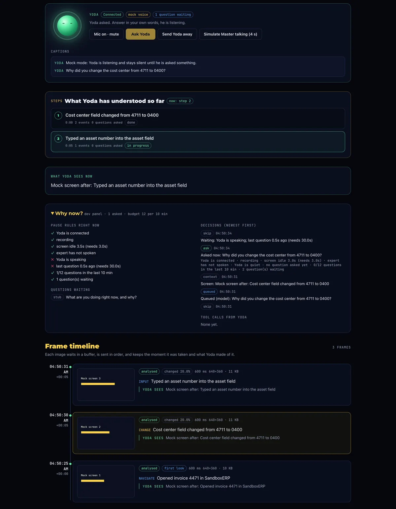
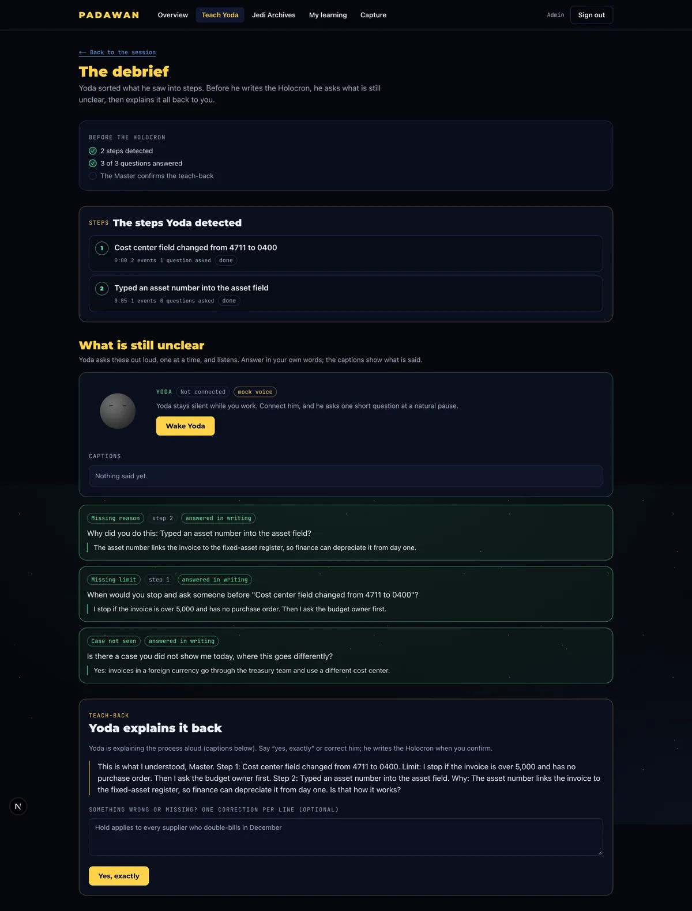
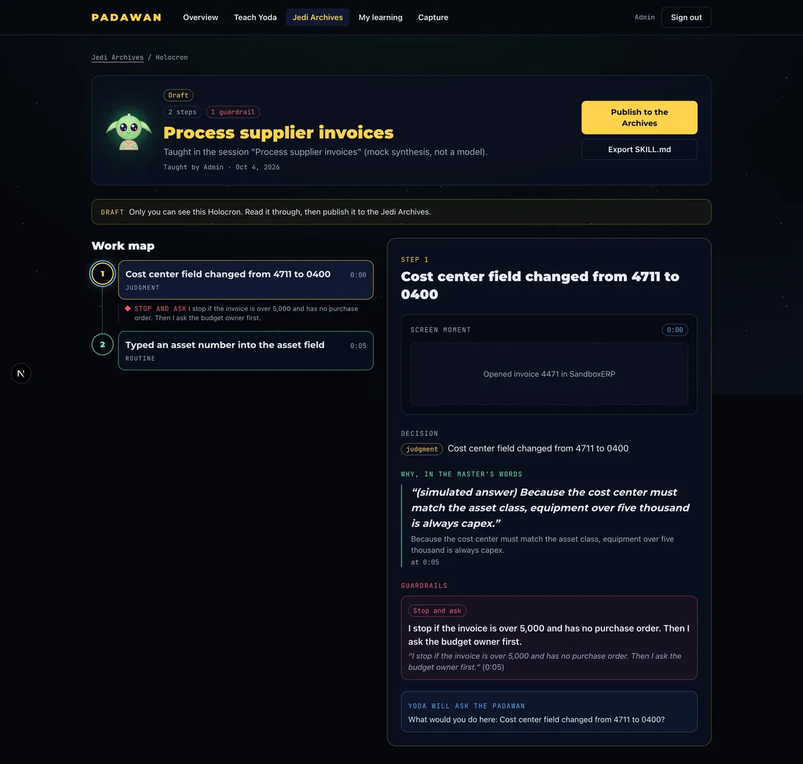
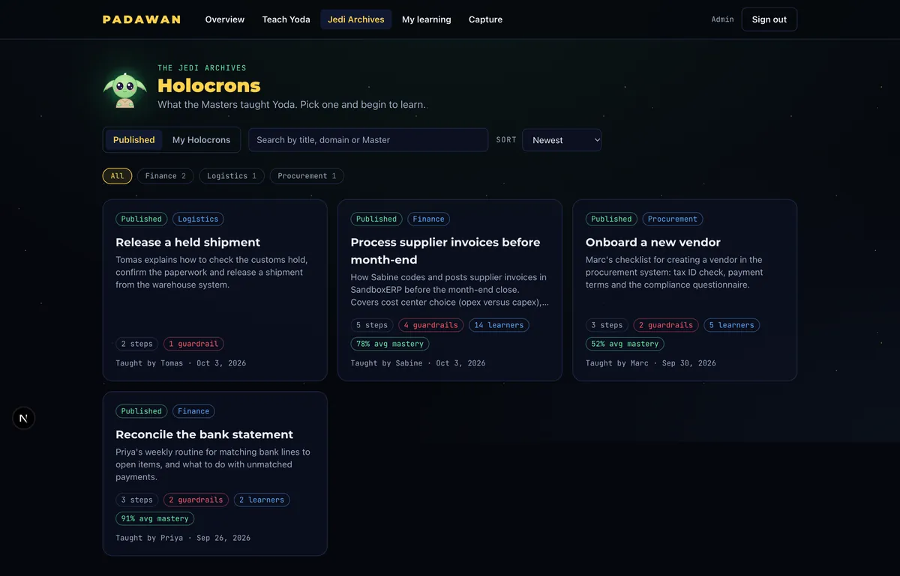
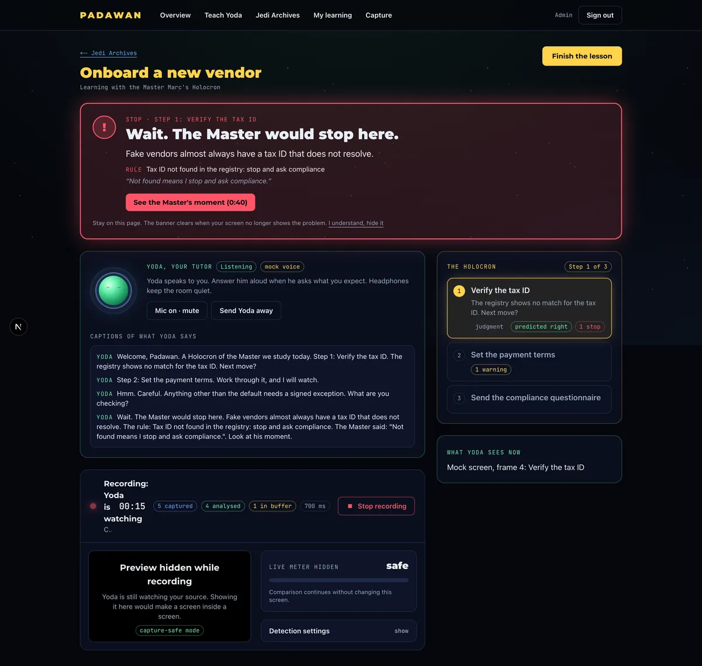
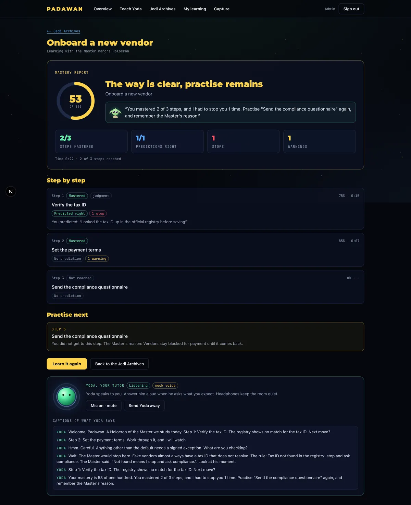

# Padawan

> Teach Yoda what you know.

Padawan captures what an expert really does on screen. A voice agent (**Yoda**) watches the shared screen, stays quiet while the expert works, asks *why* at the right pause, and turns the session into a **Holocron**: a skill with steps, reasons and guardrails. Later Yoda tutors the next hire (the **Padawan**) on their own screen and stops them before they break a rule.

Built for the Hack-Nation 7th Global AI Hackathon, challenge 01 "The AI Apprentice" (powered by ElevenLabs). Star Wars themed (names and styling only, no official assets).

| | |
|---|---|
| Frontend (live) | https://padawan-bay.vercel.app |
| Backend (live) | https://padawan.fastapicloud.dev (API docs at `/docs`) |
| Database and login | Supabase, project `reuueppvukwdiytfxezj` |
| Tickets | [GitHub issues](https://github.com/umairtufail/Padawan/issues) |
| Full design | Notion: **Padawan - Hack-nation 07** (pages 00 to 11) |

> Vercel builds are rate limited on the free plan at times, so the live frontend can lag behind `main`. Check the deployment status on the commit.

## Screenshots

Real screenshots of the running app, captured in the frontend's mock mode (`NEXT_PUBLIC_API_MOCK=1`). All data is mock data: no real people, emails or keys, and Yoda's voice is scripted. They show the screens, not model quality.

| | | |
|---|---|---|
| [](docs/screenshots/04-teach-session.webp) | [](docs/screenshots/05-debrief.webp) | [](docs/screenshots/06-holocron-work-map.webp) |
| **Teach:** the Master works, Yoda asks why at a pause; captions, steps and the frame timeline fill in. | **Debrief:** open gap questions are answered, then Yoda explains the process back (teach-back). | **Holocron:** the draft skill as a work map with steps, the Master's reasons and a stop-and-ask guardrail. |
| [](docs/screenshots/07-jedi-archives.webp) | [](docs/screenshots/08-learn-stop-banner.webp) | [](docs/screenshots/09-mastery-report.webp) |
| **Archives:** published Holocrons with learner and mastery stats, search, sort and domain chips. | **Learn:** the Padawan is about to break a guardrail and Yoda stops them with the red banner. | **Report:** the mastery report after the lesson: score, steps, predictions, stops, what to practise. |

More: [landing](docs/screenshots/01-landing.webp), [login](docs/screenshots/02-login.webp), [dashboard](docs/screenshots/03-dashboard.webp), [My learning](docs/screenshots/10-my-learning.webp), [phone width (Archives)](docs/screenshots/11-archives-mobile.webp).

## How it works

```
Browser (Next.js on Vercel)                       FastAPI on FastAPI Cloud            Supabase
  share screen, frame gate  --JPEG frame-->  /v1/sessions/{id}/frames  --(user's token)-->  sessions, events
  Yoda voice (ElevenLabs)   <--events------   vision model (Nebius, DeepSeek V4.1 Flash)    RLS enforces owner
```

1. **Capture:** the expert shares a screen. The browser sends only frames that changed.
2. **Understand:** the backend asks a vision model what *changed* compared with the previous frame and returns structured events.
3. **Ask:** a pause controller decides when Yoda speaks (screen idle, expert silent, question budget left).
4. **Debrief:** when the expert finishes, Yoda asks the open gap questions by voice and explains the process back (teach-back).
5. **Holocron:** the confirmed session becomes a skill (steps, reasons, guardrails, quotes), reviewed and published to the Jedi Archives. The Nebius text model names it (a specific 3 to 8 word title in the session language, never "New task"), writes a description and a one-paragraph summary, and the session list takes over that name.
6. **Learn:** a new hire picks a Holocron and shares their screen; Yoda tutors by voice, asks for predictions, stops the wrong move before Save, and ends with a mastery report.

Yoda always speaks his questions aloud (realtime ElevenLabs voice); the text on screen is only captions.

## Architecture: what is built and what is not

[](docs/architecture.md)

Green is built and merged to `main`, gray dashed is still to build. Status table and the editable Mermaid version: [`docs/architecture.md`](docs/architecture.md).

## Repository layout

```
frontend/    Next.js 16 (App Router, TypeScript): dashboard, capture and Yoda voice UI, debrief, Holocrons, Archives, learn session
backend/     FastAPI, managed with uv
  app/routers/    HTTP endpoints
  app/services/   vision, question planner, segmenter, gap finder, skill synthesizer, guardrail checker, PII redaction, keyframes, ElevenLabs
  app/prompts/    the prompts, as editable .md files
  app/auth.py     Supabase token check        app/repo.py   storage (memory or Supabase)
  scripts/        manual model tests (test_vision, eval_vision)
  tests/          pytest (+ fixtures/frames)
supabase/    migrations (the exact SQL applied to the project) and a README
packages/    shared schemas (placeholder)
docs/        guides, start with frontend-integration.md
AGENTS.md    rules for everyone working here, human or AI
```

## Quick start Guide

You need [uv](https://docs.astral.sh/uv/) (backend) and Node 20+ (frontend).

```bash
# copy the team keys from the Notion page "Keys and environment values" into a repo-root .env (gitignored)
# If you ever need a fresh one: cp .env.example .env and fill it in.

# backend  -> http://localhost:8000  (docs at /docs)
cd backend && uv sync && uv run fastapi dev app/main.py

# frontend -> http://localhost:3000   (second terminal)
cd frontend && cp .env.example .env.local && npm install && npm run dev
```

**Three modes**, set by `AUTH_MODE` in `.env`:

| Mode | Login | Data | When |
|---|---|---|---|
| `dev` (default) | none | in memory, lost on restart | building UI fast, no Supabase needed |
| `admin` | demo account (default `admin` / `admin`), token from `POST /v1/auth/login` | in memory | the deployed demo until Supabase login is in the UI |
| `supabase` | Supabase access token (Bearer) | Postgres | the real flow and the demo |

The frontend developer's guide (formats, a TypeScript client, curl examples) is [`docs/frontend-integration.md`](docs/frontend-integration.md).

Use cases beyond forms (video editor, Figma handoff, support triage, dashboards, releases and more, with a demo ranking): [`docs/use-cases.md`](docs/use-cases.md).

Demo and pitch: the runbook with pre-flight checklist, 3-minute script, fallback table and judge Q&A is [`docs/demo.md`](docs/demo.md). `cd backend && uv run python -m scripts.seed_demo` seeds a published sample Holocron so Learn mode works even if Capture fails.

## API

Every endpoint except `/health` needs a Bearer token. Full shapes, TypeScript types and examples: [`docs/frontend-integration.md`](docs/frontend-integration.md); live OpenAPI at `/docs`.

| Area | Endpoints |
|---|---|
| Health, login | `GET /health`, `POST /v1/auth/login` (demo, `dev` and `admin` modes) |
| Teach sessions | `POST /v1/teach/sessions`, `GET /v1/sessions`, `GET /v1/sessions/{id}`, `POST /v1/sessions/{id}/frames` (JPEG in, events, question candidates and step update out), `POST /v1/sessions/{id}/off-the-record`, `GET /v1/sessions/{id}/keyframes/{t_ms}` |
| Debrief | `POST /v1/sessions/{id}/utterances`, `.../questions/{qid}/asked`, `.../answers`, `GET .../steps`, `POST .../finish` (steps and gaps), `POST .../teachback` (draft Holocron, returns its AI `title`, `description`, `summary`) |
| Holocrons | `GET /v1/skills`, `GET /v1/skills/{id}`, `POST /v1/skills/{id}/publish`, `GET /v1/skills/{id}/export` (SKILL.md) |
| Learn | `POST /v1/learn/sessions`, `.../frames` (adds a `verdict`: ok, warn, stop), `.../predictions`, `.../report`, `.../finish` |
| Voice | `POST /v1/voice/sessions` (signed URL and variables for the Yoda interviewer or tutor) |

Frames go **straight from the browser to the backend**, never through a Next.js API route (Vercel body limit 4.5 MB).

## Configuration

The repo is public: no secret is ever committed (see `AGENTS.md`, rule 1). The team keys live on the private Notion page "Keys and environment values".

| Variable | Backend `.env` / FastAPI Cloud | Frontend `.env.local` / Vercel |
|---|---|---|
| `AUTH_MODE` | `dev` locally, `admin` or `supabase` deployed (unset = `admin`, so a forgotten setting is closed) | |
| `ADMIN_USER`, `ADMIN_PASSWORD`, `ADMIN_JWT_SECRET` | demo account for `admin` mode (default `admin` / `admin`; **change on a public deployment**) | |
| `SUPABASE_URL`, `SUPABASE_PUBLISHABLE_KEY`, `SUPABASE_JWKS_URL` | yes (public values) | |
| `NEXT_PUBLIC_SUPABASE_URL`, `NEXT_PUBLIC_SUPABASE_ANON_KEY` | | yes (public values) |
| `NEXT_PUBLIC_AUTH_MODE` | | `admin` (default) or `supabase`, must match the backend's `AUTH_MODE` ([`docs/supabase-login.md`](docs/supabase-login.md)) |
| `NEXT_PUBLIC_API_URL` | | `http://localhost:8000` locally, the FastAPI Cloud URL deployed |
| `NEBIUS_API_KEY` (secret), `NEBIUS_BASE_URL`, `NEBIUS_VLM_MODEL` | yes | |
| `NEBIUS_TEXT_MODEL` | no | text model for the question planner and the skill synthesizer; empty = the vision model. `zai-org/GLM-5.3` is worth trying for synthesis (see `docs/frontend-integration.md`) |
| `ELEVENLABS_API_KEY` (secret), `ELEVENLABS_*_AGENT_ID` | yes | |
| `ALLOWED_ORIGINS` | the frontend URLs, comma separated (include the Vercel URL) | |
| `SUPABASE_SERVICE_ROLE_KEY` | not used today | **never** |

## Deploying
Live status checklist (tick as you deploy): [`docs/deployment.md`](docs/deployment.md#live-deployment-status-update-this-as-you-go).

Full guide with the exact variables for FastAPI Cloud and Vercel, a verification checklist and troubleshooting: [`docs/deployment.md`](docs/deployment.md). **Never deploy with `AUTH_MODE=dev`**, it needs no login.

- **Backend** (FastAPI Cloud): set the variables above, then `cd backend && uv run fastapi deploy`. Remember `ALLOWED_ORIGINS`, otherwise the browser is blocked by CORS.
- **Frontend** (Vercel): connected to the repo; set the `NEXT_PUBLIC_*` variables.
- **Supabase**: set the Site URL to the Vercel URL, add `http://localhost:3000` as a redirect URL, keep sign-ups and Confirm email on (people create their own account on the login page). See [`docs/supabase-login.md`](docs/supabase-login.md).

## Tests

```bash
cd backend                     #backend directory
uv run pytest                  # offline and fast (the model is faked); CI runs it on every PR
cd ../frontend && npm run lint && npm test && npm run build
uv run pytest -m live          # calls the real vision model
uv run python -m scripts.eval_vision --trials 5   # does the model detect differences correctly?
```

## Status
**Built:** screen capture with change detection, vision to events (DeepSeek V4.1 Flash, about 1 to 2 s per frame), PII redaction and off the record, question planner, Yoda voice (agents, signed URLs, voice UI, pause controller), steps and gap finder, debrief and teach-back, skill synthesizer, Holocron view, Jedi Archives, learn mode with the guardrail checker and mastery report, keyframes in Supabase Storage, Supabase login with self sign-up, CI.

**Tested for real:** the whole teach flow (session, frames, utterances, a question and its answer, finish, teach-back) against the real models and Supabase as a real test user: every table is written and the skill and the session carry the AI title and summary (a German session gets a German title); the pipeline against the real vision model and Supabase (two users, row-level security), spoken questions over a real ElevenLabs websocket, the guardrail checker (40 of 40 on hand-written cases), the debrief and learn flows in a browser with a fake screen share.

**Not tested yet:** a browser session with a real microphone and the ElevenLabs agent, real screen recordings of a real workflow (#39), token renewal after an hour, the Supabase login on the deployed frontend (needs the dashboard settings in `docs/supabase-login.md`).

**Known limits:** guardrail checks and gaps for unasked questions live partly in server memory (lost on restart), free-form names and addresses are not redacted, learners cannot see an author's keyframes.

## Team
Javier Peres, Shibu Murugan, Umair Tufail, Deepika Sahi Kandanoor.

## Working together
Read [`AGENTS.md`](AGENTS.md) before you start. Short version: one branch per task, small pull requests into `main`, no secrets in git, tests for what you change.
