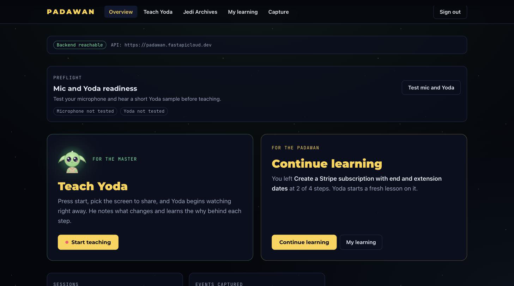
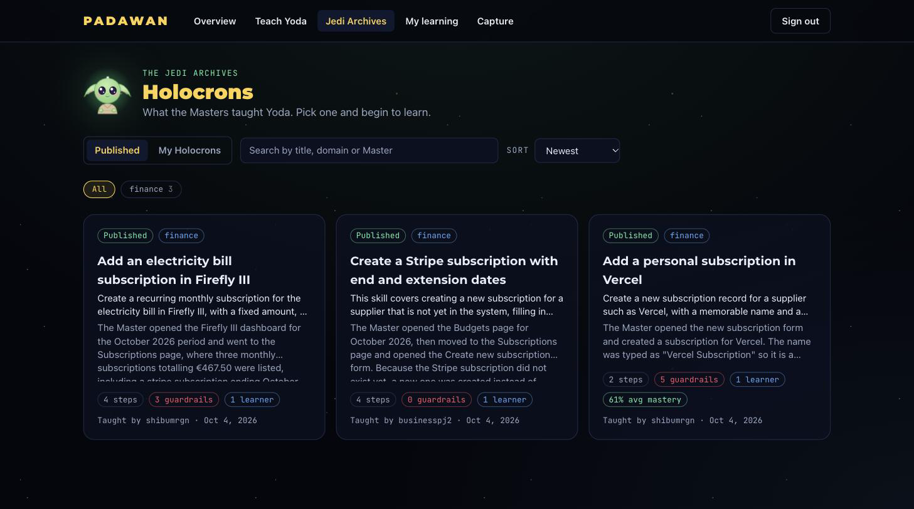
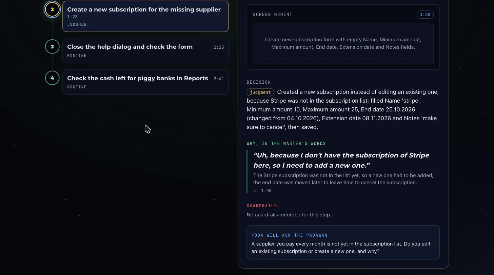
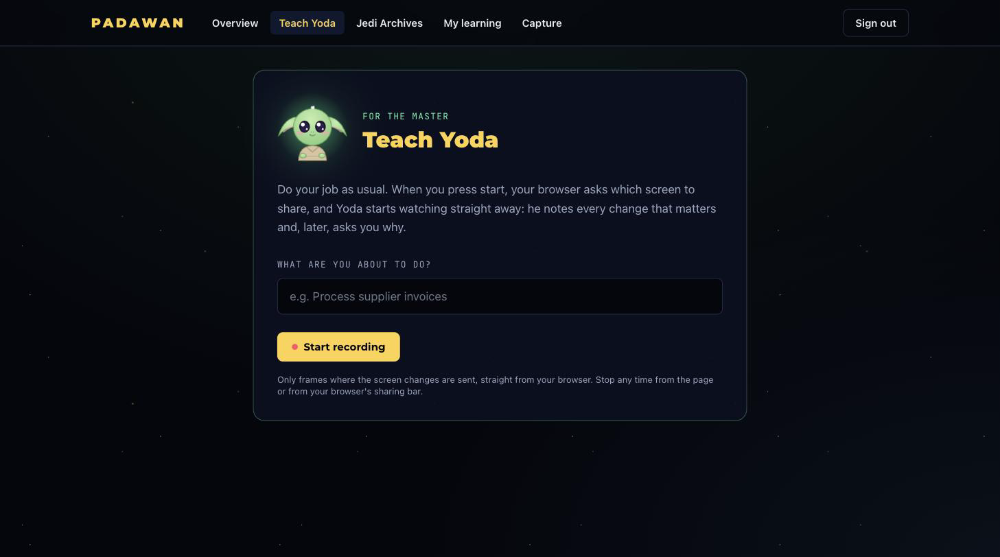
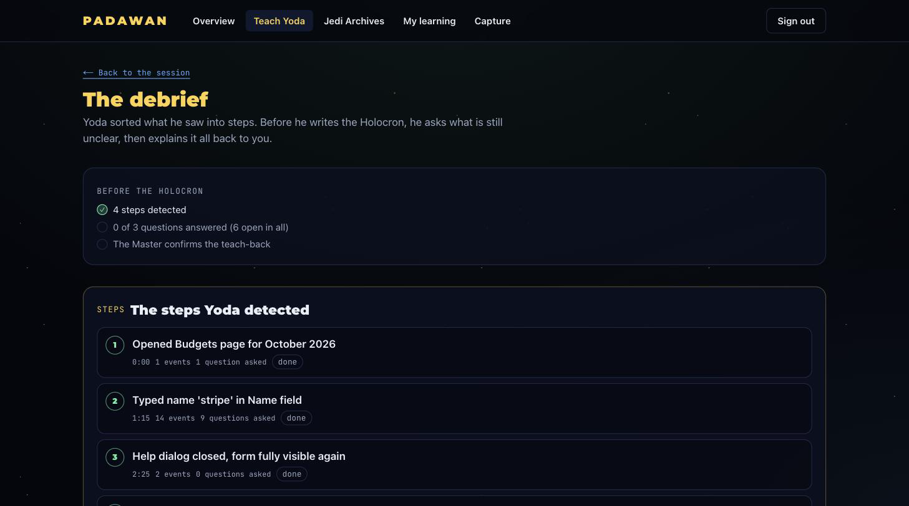
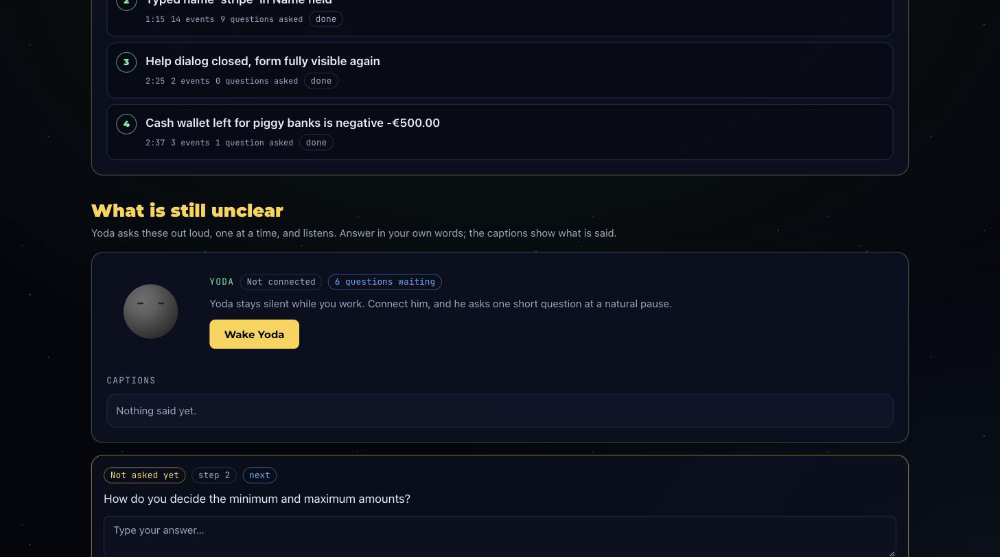
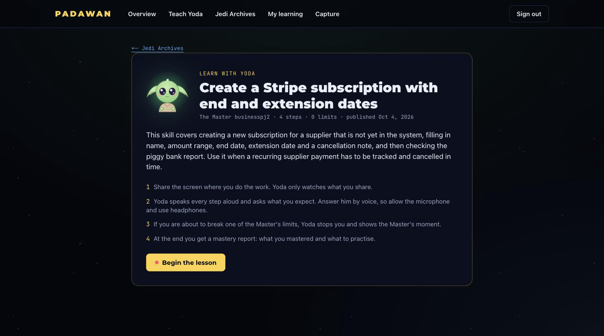
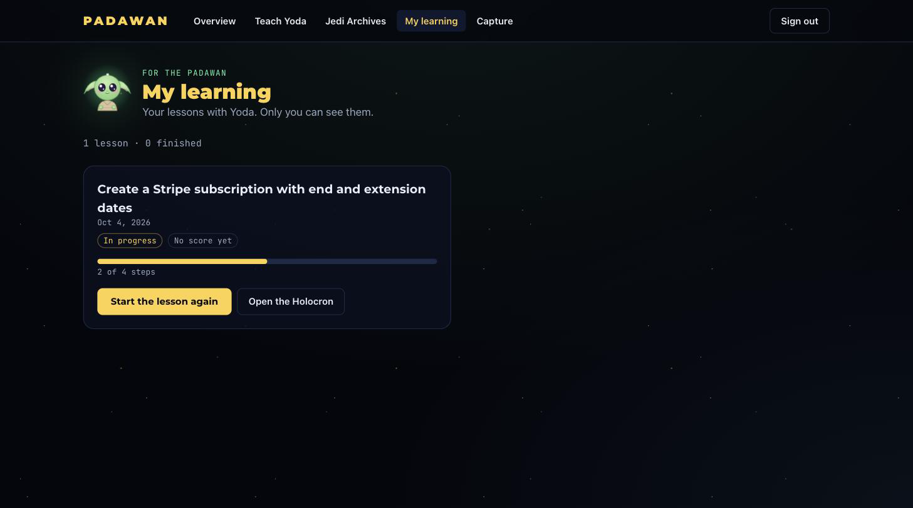
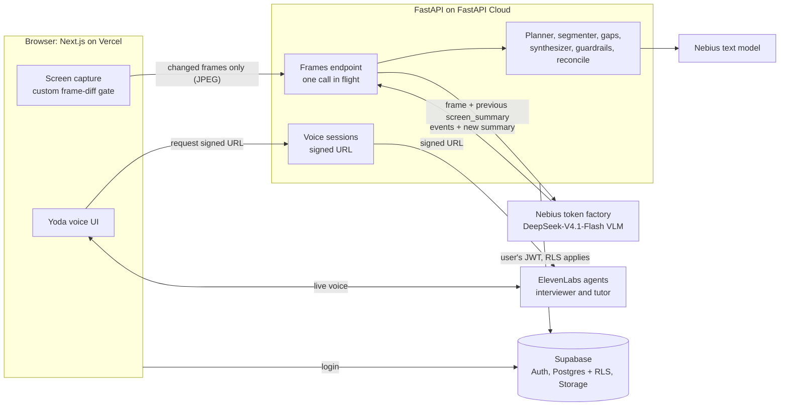

# Padawan

> Teach Yoda what you know. Yoda teaches the next person, and stops them before they break a rule.

Padawan turns "watch me do it" into reusable skills. A **Master** shares their screen and talks through a task. A voice agent, **Yoda**, watches, stays quiet while the Master works, and asks *why* at natural pauses. The session becomes a **Holocron**: a saved skill with steps, the Master's reasons and guardrails. Later Yoda tutors a **Padawan** through that Holocron on their own screen and stops them before they break a guardrail.

Built for the Hack-Nation 7th Global AI Hackathon (2026), challenge 01 "The AI Apprentice" (powered by ElevenLabs).

**Live demo: https://padawan-bay.vercel.app** (sign up with an email on the login page; backend API docs at https://padawan.fastapicloud.dev/docs)

**Glossary.** Master = the expert who teaches. Padawan = the learner. Holocron = a saved skill. Jedi Archives = the library of published Holocrons. Yoda = the AI. Star Wars names and our own styling only: no official logos, stills, music or voice.

## What it does

1. **Teach.** The Master shares a screen and narrates. The browser sends only the frames where the screen really changed.
2. **Understand.** A vision model describes what changed and returns structured events.
3. **Ask why.** At a natural pause (screen idle, Master silent, question budget left) Yoda asks about intent: why this tab, why option X over Y. He does not ask what the screen already shows.
4. **Debrief.** When the Master stops, Yoda asks the still-open questions and explains the process back (teach-back).
5. **Holocron.** The confirmed session is synthesized into a skill (steps, reasons, guardrails, quotes), reviewed, and published to the Jedi Archives.
6. **Learn.** A Padawan picks a Holocron and shares their screen. Yoda tutors by voice, asks for predictions, and shows a red STOP before a guardrail is broken. The lesson ends with a mastery report.

## How it looks

Real captures of the live app at https://padawan-bay.vercel.app (header email painted over; static states, nothing recorded or published for the shots). Details in [`docs/screenshots/MANIFEST.md`](docs/screenshots/MANIFEST.md).

| | |
|---|---|
| [](docs/screenshots/01-dashboard.png) | [](docs/screenshots/02-skills-library.png) |
| **Dashboard:** backend status, mic and Yoda preflight, Teach and Learn entry points. | **Jedi Archives:** published Holocrons with tags, guardrail counts and learner counts. |
| [](docs/screenshots/03b-skill-detail-step-why-question.png) | [](docs/screenshots/04-teach-start.png) |
| **Holocron step:** the decision, the Master's own "why", guardrails, and the question Yoda will ask the Padawan. | **Teach:** name the task, start recording. |
| [](docs/screenshots/05-debrief-steps.png) | [](docs/screenshots/05b-debrief-questions.png) |
| **Debrief:** the steps detected from the session, checked before the Holocron is built. | **Debrief:** "What is still unclear" and the Yoda voice panel with the first open question. |
| [](docs/screenshots/06-learn-start.png) | [](docs/screenshots/07-my-learning-progress.png) |
| **Learn:** the Padawan begins a lesson from a Holocron. | **My learning:** a lesson in progress, 2 of 4 steps. |

Not captured live (they need screen-share and microphone prompts): an active recording, a Yoda voice session, the learn STOP banner and the mastery report. Those two screens exist as captures of the frontend's mock mode (`NEXT_PUBLIC_API_MOCK=1`, scripted data, not model output): [STOP banner](docs/screenshots/08-learn-stop-banner.webp), [mastery report](docs/screenshots/09-mastery-report.webp).

## Architecture



Notes on the arrows, checked against the code:
- The frame-diff runs **in the browser** (`frontend/lib/frame-diff.ts`), before anything is uploaded. Frames go straight from the browser to the backend, never through a Next.js route (Vercel's 4.5 MB body limit).
- The voice audio goes **browser to ElevenLabs** over a websocket. The backend only mints the signed URL and the per-session variables (`POST /v1/voice/sessions`); it does not carry audio.
- The backend calls Supabase as the user (their Bearer token is forwarded), so row-level security enforces ownership.
- A second, editable status map with what is built and what is not: [`docs/architecture.md`](docs/architecture.md).

## Tech stack

| Component | Tech | Role |
|---|---|---|
| Frontend | Next.js 16 (App Router), TypeScript, hosted on Vercel | Dashboard, screen capture, frame-diff, Yoda voice UI, debrief, Holocron view, Jedi Archives, learn session |
| Backend | FastAPI (Python, managed with uv), hosted on FastAPI Cloud | Frames API, question planner, step segmenter, gap finder, skill synthesizer, guardrail checker, PII redaction, answer reconcile |
| Vision model | Nebius token factory, `deepseek-ai/DeepSeek-V4.1-Flash` (configurable) | Frame to structured events and a screen summary |
| Text model | Nebius, `NEBIUS_TEXT_MODEL` (empty = the vision model) | Question planner, skill synthesizer, answer matching, mastery summary |
| Voice | ElevenLabs agents (interviewer and tutor), created by `backend/scripts/setup_voice_agents.py` | Realtime conversation with Yoda; client tools such as `log_answer` |
| Auth and data | Supabase: Auth, Postgres with row-level security, private Storage bucket | Login, sessions, events, skills, learn attempts, step keyframes |
| CI | GitHub Actions (`.github/workflows/ci.yml`) | Backend and frontend checks on every PR |

## Key engineering decisions

**Custom frame-diff, in the browser.** `frontend/lib/frame-diff.ts` decides whether the screen changed enough to be worth a model call. What it does:
- Samples the shared screen 2 times per second (adjustable) on a 640x360 grayscale copy, split into 20 px blocks.
- A pixel counts as changed if its luma differs by 25 or more (default tolerance, adjustable in the capture settings).
- A block counts as changed when at least 4% of its pixels changed. Changed blocks are grouped into 8-connected clusters.
- A frame is significant if it passes any of these: changed area of 3% of the screen or more (large area); a cluster of at least 2 adjacent blocks (local edit); at least 3 scattered blocks; or one block with 25% or more changed pixels. The three local rules also need at least 0.03% of all pixels changed, which filters a moving mouse cursor.
- It compares against the last frame that was sent, and waits for the screen to settle (no significant motion for 0.5 s, or 3 s at most) with a 1 s cooldown, so a half-loaded page or a typing burst is sent once. The first frame is always sent.
- Tests: `frontend/lib/frame-diff.test.ts`.

Why: fewer frames means lower cost and lower latency, and the model sees only moments that mean something. A single field edit still counts, a cursor does not. Frames are then downscaled to at most 1024 px wide JPEG (quality 0.6) before upload.

**DeepSeek for speed.** Sending frames to the vision model was the slowest part of the loop. We moved to `DeepSeek-V4.1-Flash` on Nebius for lower latency; `zai-org/GLM-5.3-Flash` is the fallback and needs "thinking" turned off, which `services/vision.py` does. The model is a setting (`NEBIUS_VLM_MODEL`), and `scripts/eval_vision.py` compares models and prompts.

**Previous `screen_summary` as memory.** Each vision call sends the new frame plus the summary of the previous one, so the model reports what *changed* instead of re-describing the screen. The prompt requires the summary to carry current field values.

**One vision call in flight, skip, never queue.** The backend holds a lock per session; a frame that arrives while one is being analysed gets `skipped: busy`. Timeouts (8 s default), model errors and unparseable output also return `skipped` and never break the stream. The browser sends one frame at a time, buffers at most 6, and retries the very first look up to twice.

**Answers captured live, reconciled on stop.** Yoda's `log_answer` tool and a "Master stopped talking" timer (2.5 s of quiet) attach each spoken answer to its question while the session runs. When the session stops, `services/reconcile.py` fills any question that still has no answer from the full transcript: the model picks transcript line indexes (the text is copied from the transcript, not written by the model) with a deterministic pairing as fallback. It never overwrites a typed or edited answer, and this runs before the skill is built.

**Questions about intent only.** Prompts receive today's date; the planner and interviewer are told never to ask about dates, page titles or anything visible. A code filter backs the prompt up: the gap finder drops year-like terms and the planner drops candidates asking about a year or the date.

**Row-level security and the user's token.** The backend never trusts a user id from the client. It verifies the Supabase JWT (against the JWKS URL) and then calls Supabase with that same token, so RLS decides what each request may read or write. Every table has RLS and policies (`supabase/migrations/`). Published skills are readable by any signed-in user; sessions and their events, utterances and questions are readable only by their owner.

**Prompts are files.** All prompts live in `backend/app/prompts/*.system.md`. After a prompt change run `scripts.eval_vision` before and after.

## Challenges and what we fixed

| Problem | What we did |
|---|---|
| **Latency.** Watch, understand, ask and answer had to feel live. | Browser-side frame gating, one vision call in flight with skip-not-queue, short timeouts with graceful fallbacks, and a fast model. |
| **Slow image processing.** Frames took too long to analyse. | Switched the vision model to DeepSeek-V4.1-Flash on Nebius. |
| **Too many frames.** Raw sampling was wasteful. | Wrote our own frame-diff (above) so only meaningful changes are uploaded. |
| **Trivial questions** such as "why 2026?". | Inject today's date into the prompts, restrict questions to unclear intent, and add the gap-finder and planner filters. |
| **Answers not filled in** after stopping a session. | Live attach of each answer (about 2.5 s after the Master stops talking) plus the on-stop reconcile step. |
| **Learn mode needed fixing** in the guided replay. | Iterated on the learn flow; see `docs/frontend-integration.md` and the learn tests. We did not record a before and after, so no metric is claimed. |
| **Skills were not persisting.** The deployed backend ran with `AUTH_MODE=dev` (in-memory repo). | Switched to `AUTH_MODE=supabase`; skills now persist in Postgres and Yoda replays them. |

## Limitations and what is mocked or untested

- **No benchmark numbers.** "About 1 to 2 s per frame" in our notes is what we saw in manual runs on a shared endpoint, not a measured benchmark; speed varies a lot between calls.
- **Voice was tested by hand.** The ElevenLabs agents and a real microphone were only checked manually in a browser. The offline tests fake the model and Supabase. A real spoken question was verified over a websocket in an earlier check; there is no automated end-to-end test with a live mic.
- **Small evaluations.** The guardrail checker scored 40 of 40 on hand-written cases and the vision check 25 of 25 on our mock ERP frames. These are not real recordings of real work.
- **Not covered:** real recordings of long real workflows (#39), token renewal after an hour, a large user study.
- **Mock mode.** `NEXT_PUBLIC_API_MOCK=1` serves scripted data for UI work; two screenshots above come from it and are labelled.
- **Known gaps:** some guardrail and gap state lives in server memory (lost on restart, per instance), free-form names and addresses are not redacted (only pattern-based PII is), learners cannot see an author's keyframes.
- **Demo data.** The sample sessions in the screenshots contain made-up finance amounts.

## Demo videos

- Team video: link to be added after upload (file: `videos/video-team/video-team.mp4`, kept outside this repo).
- Tech video (60 s): link to be added after upload (file: `videos/video-tech/video-tech.mp4`, kept outside this repo).

## Deployment

| Part | Where | Notes |
|---|---|---|
| Frontend | Vercel, https://padawan-bay.vercel.app | Connected to the repo. Vercel's free plan can rate limit builds, so check that the latest commit deployed. |
| Backend | FastAPI Cloud, https://padawan.fastapicloud.dev | `cd backend && uv run fastapi deploy` |
| Auth and data | Supabase | Migrations in `supabase/migrations/`; Site URL set to the Vercel URL, `http://localhost:3000` as an extra redirect URL |
| Voice | ElevenLabs agents | Created and updated by a script (below) |

Required environment variable **names** (values are never in git; set them in the FastAPI Cloud and Vercel dashboards):
- Backend: `AUTH_MODE`, `SUPABASE_URL`, `SUPABASE_PUBLISHABLE_KEY`, `SUPABASE_JWKS_URL`, `NEBIUS_API_KEY`, `NEBIUS_BASE_URL`, `NEBIUS_VLM_MODEL`, `ELEVENLABS_API_KEY`, `ELEVENLABS_INTERVIEWER_AGENT_ID`, `ELEVENLABS_TUTOR_AGENT_ID`, `ALLOWED_ORIGINS`. Optional: `NEBIUS_TEXT_MODEL`.
- Frontend: `NEXT_PUBLIC_API_URL`, `NEXT_PUBLIC_AUTH_MODE`, `NEXT_PUBLIC_SUPABASE_URL`, `NEXT_PUBLIC_SUPABASE_ANON_KEY`.

Rules:
- **`AUTH_MODE` must be `supabase` in production** (and `NEXT_PUBLIC_AUTH_MODE=supabase` on the frontend). `dev` has no login and keeps data in memory: never deploy it. This was the cause of our "skills not persisting" bug.
- **After you change `interviewer.system.md` or `tutor.system.md`,** re-run `cd backend && uv run python -m scripts.setup_voice_agents` so the new prompt is pushed to ElevenLabs. The script is safe to re-run (it updates agents by name). Prompts are not read from the repo at call time.
- Do not put `SUPABASE_SERVICE_ROLE_KEY` in the frontend or in git.
- The full guide with troubleshooting is [`docs/deployment.md`](docs/deployment.md); the Supabase login setup is [`docs/supabase-login.md`](docs/supabase-login.md).

## Team

Hack-Nation 2026: Javier Peres, Shibu Murugan, Umair Tufail, Deepika Sahi Kandanoor. We are looking for co-founders.

## Quick start Guide

You need [uv](https://docs.astral.sh/uv/) (backend) and Node 20+ (frontend).

```bash
# create a repo-root .env (gitignored): cp .env.example .env and fill it in (team members: see the private Notion keys page)

# backend  -> http://localhost:8000  (docs at /docs)
cd backend && uv sync && uv run fastapi dev app/main.py

# frontend -> http://localhost:3000   (second terminal)
cd frontend && cp .env.example .env.local && npm install && npm run dev
```

**Three modes**, set by `AUTH_MODE` in `.env`:

| Mode | Login | Data | When |
|---|---|---|---|
| `dev` | none | in memory, lost on restart | building UI fast, no Supabase needed; local only |
| `admin` (default if unset) | demo account (`ADMIN_USER` / `ADMIN_PASSWORD`, defaults `admin` / `admin`), token from `POST /v1/auth/login` | in memory | a closed fallback; set your own password if you ever expose it |
| `supabase` | Supabase access token (Bearer) | Postgres | the real flow, and production |

More: the frontend developer's guide (formats, a TypeScript client, curl examples) is [`docs/frontend-integration.md`](docs/frontend-integration.md). Use cases beyond forms: [`docs/use-cases.md`](docs/use-cases.md). The demo runbook (checklist, 3-minute script, fallbacks, judge Q&A) is [`docs/demo.md`](docs/demo.md); `cd backend && uv run python -m scripts.seed_demo` seeds a published sample Holocron so Learn mode works even if Capture fails.

## Repository layout

```
frontend/    Next.js 16 (App Router, TypeScript): dashboard, capture and Yoda voice UI, debrief, Holocrons, Archives, learn session
backend/     FastAPI, managed with uv
  app/routers/    HTTP endpoints
  app/services/   vision, question planner, segmenter, gap finder, skill synthesizer, guardrail checker, PII redaction, keyframes, ElevenLabs
  app/prompts/    the prompts, as editable .md files
  app/auth.py     Supabase token check        app/repo.py   storage (memory or Supabase)
  scripts/        manual model tests (test_vision, eval_vision)
  tests/          pytest (+ fixtures/frames)
supabase/    migrations (the exact SQL applied to the project) and a README
packages/    shared schemas (placeholder)
docs/        guides, start with frontend-integration.md
AGENTS.md    rules for everyone working here, human or AI
```

## API

Every endpoint except `/health` needs a Bearer token. Full shapes, TypeScript types and examples: [`docs/frontend-integration.md`](docs/frontend-integration.md); live OpenAPI at `/docs`.

| Area | Endpoints |
|---|---|
| Health, login | `GET /health`, `POST /v1/auth/login` (demo, `dev` and `admin` modes) |
| Teach sessions | `POST /v1/teach/sessions`, `GET /v1/sessions`, `GET /v1/sessions/{id}`, `POST /v1/sessions/{id}/frames` (JPEG in, events, question candidates and step update out), `POST /v1/sessions/{id}/off-the-record`, `GET /v1/sessions/{id}/keyframes/{t_ms}` |
| Debrief | `POST /v1/sessions/{id}/utterances`, `.../questions/{qid}/asked`, `.../answers`, `GET .../steps`, `POST .../finish` (steps and gaps), `POST .../teachback` (draft Holocron, returns its AI `title`, `description`, `summary`) |
| Holocrons | `GET /v1/skills`, `GET /v1/skills/{id}`, `POST /v1/skills/{id}/publish`, `GET /v1/skills/{id}/export` (SKILL.md) |
| Learn | `POST /v1/learn/sessions`, `.../frames` (adds a `verdict`: ok, warn, stop), `.../predictions`, `.../report`, `.../finish` |
| Voice | `POST /v1/voice/sessions` (signed URL and variables for the Yoda interviewer or tutor) |

Frames go **straight from the browser to the backend**, never through a Next.js API route (Vercel body limit 4.5 MB).

## Configuration

The repo is public: no secret is ever committed (see `AGENTS.md`, rule 1). The team keys live on the private Notion page "Keys and environment values".

| Variable | Backend `.env` / FastAPI Cloud | Frontend `.env.local` / Vercel |
|---|---|---|
| `AUTH_MODE` | `dev` locally, `supabase` deployed (unset = `admin`, so a forgotten setting is closed) | |
| `ADMIN_USER`, `ADMIN_PASSWORD`, `ADMIN_JWT_SECRET` | demo account for `admin` mode (default `admin` / `admin`; **change on a public deployment**) | |
| `SUPABASE_URL`, `SUPABASE_PUBLISHABLE_KEY`, `SUPABASE_JWKS_URL` | yes (public values) | |
| `NEXT_PUBLIC_SUPABASE_URL`, `NEXT_PUBLIC_SUPABASE_ANON_KEY` | | yes (public values) |
| `NEXT_PUBLIC_AUTH_MODE` | | `admin` (default) or `supabase`, must match the backend's `AUTH_MODE` ([`docs/supabase-login.md`](docs/supabase-login.md)) |
| `NEXT_PUBLIC_API_URL` | | `http://localhost:8000` locally, the FastAPI Cloud URL deployed |
| `NEBIUS_API_KEY` (secret), `NEBIUS_BASE_URL`, `NEBIUS_VLM_MODEL` | yes | |
| `NEBIUS_TEXT_MODEL` | no | text model for the question planner and the skill synthesizer; empty = the vision model. `zai-org/GLM-5.3` is worth trying for synthesis (see `docs/frontend-integration.md`) |
| `ELEVENLABS_API_KEY` (secret), `ELEVENLABS_*_AGENT_ID` | yes | |
| `ALLOWED_ORIGINS` | the frontend URLs, comma separated (include the Vercel URL) | |
| `SUPABASE_SERVICE_ROLE_KEY` | not used today | **never** |

## Tests

```bash
# backend
cd backend
uv run pytest                  # offline and fast (the model is faked); CI runs it on every PR
uv run ruff check .            # lint
uv run pytest -m live          # calls the real vision model (needs NEBIUS_API_KEY)
uv run python -m scripts.eval_vision --trials 5   # does the model detect differences correctly?

# frontend
cd frontend && npm run lint && npm test && npm run build
```

## Working together

Read [`AGENTS.md`](AGENTS.md) before you start. Short version: one branch per task, small pull requests into `main`, no secrets in git, tests for what you change.
