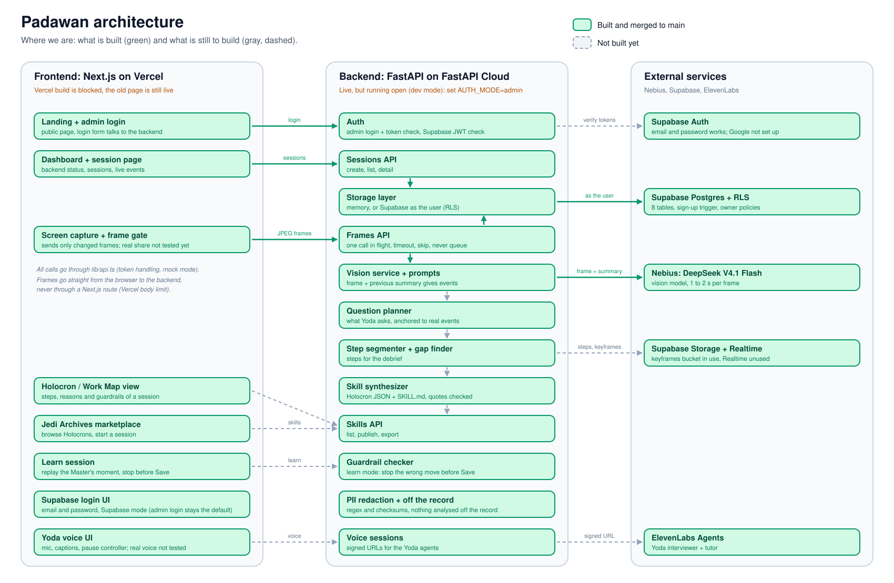

# Padawan

> Teach Yoda what you know.

Padawan captures what an expert really does on screen. A voice agent (**Yoda**) watches the shared screen, stays quiet while the expert works, asks *why* at the right pause, and turns the session into a **Holocron**: a skill with steps, reasons and guardrails. Later Yoda tutors the next hire (the **Padawan**) on their own screen and stops them before they break a rule.

Built for the Hack-Nation 7th Global AI Hackathon, challenge 01 "The AI Apprentice" (powered by ElevenLabs). Star Wars themed (names and styling only, no official assets).

| | |
|---|---|
| Frontend (live) | https://padawan-bay.vercel.app |
| Backend (live) | https://padawan.fastapicloud.dev (API docs at `/docs`) |
| Database and login | Supabase, project `reuueppvukwdiytfxezj` |
| Tickets | [GitHub issues](https://github.com/umairtufail/Padawan/issues) |
| Full design | Notion: **Padawan - Hack-nation 07** (pages 00 to 11) |

> The deployed backend only serves new endpoints after the latest `main` is redeployed. Check `/openapi.json` to see what is live.

## How it works

```
Browser (Next.js on Vercel)                       FastAPI on FastAPI Cloud            Supabase
  share screen, frame gate  --JPEG frame-->  /v1/sessions/{id}/frames  --(user's token)-->  sessions, events
  Yoda voice (ElevenLabs)   <--events------   vision model (Nebius, DeepSeek V4.1 Flash)    RLS enforces owner
```

1. **Capture:** the expert shares a screen. The browser sends only frames that changed.
2. **Understand:** the backend asks a vision model what *changed* compared with the previous frame and returns structured events.
3. **Ask:** a pause controller decides when Yoda speaks (screen idle, expert silent, question budget left).
4. **Map and teach:** the session becomes a Holocron, which Yoda later uses to tutor a new hire.

## Architecture: what is built and what is not

[](docs/architecture.md)

Green is built and merged to `main`, gray dashed is still to build. Status table and the editable Mermaid version: [`docs/architecture.md`](docs/architecture.md).

## Repository layout

```
frontend/    Next.js 16 (App Router, TypeScript): dashboard, Meet-style session UI
backend/     FastAPI, managed with uv
  app/routers/    HTTP endpoints
  app/services/   vision model call (more to come: question planner, segmenter, synthesizer)
  app/prompts/    the prompts, as editable .md files
  app/auth.py     Supabase token check        app/repo.py   storage (memory or Supabase)
  scripts/        manual model tests (test_vision, eval_vision)
  tests/          pytest (+ fixtures/frames)
supabase/    migrations (the exact SQL applied to the project) and a README
packages/    shared schemas (placeholder)
docs/        guides, start with frontend-integration.md
AGENTS.md    rules for everyone working here, human or AI
```

## Quick start

You need [uv](https://docs.astral.sh/uv/) (backend) and Node 20+ (frontend).

```bash
# the repo-root .env is already in the repo (team keys; the repo is private). Just pull.
# If you ever need a fresh one: cp .env.example .env and fill it in.

# backend  -> http://localhost:8000  (docs at /docs)
cd backend && uv sync && uv run fastapi dev app/main.py

# frontend -> http://localhost:3000   (second terminal)
cd frontend && cp .env.example .env.local && npm install && npm run dev
```

**Three modes**, set by `AUTH_MODE` in `.env`:

| Mode | Login | Data | When |
|---|---|---|---|
| `dev` (default) | none | in memory, lost on restart | building UI fast, no Supabase needed |
| `admin` | demo account (default `admin` / `admin`), token from `POST /v1/auth/login` | in memory | the deployed demo until Supabase login is in the UI |
| `supabase` | Supabase access token (Bearer) | Postgres | the real flow and the demo |

The frontend developer's guide (formats, a TypeScript client, curl examples) is [`docs/frontend-integration.md`](docs/frontend-integration.md).

## API (v0)

| Endpoint | What it does |
|---|---|
| `GET /health` | liveness |
| `POST /v1/auth/login` | demo login (`dev` and `admin` modes), returns a Bearer token |
| `POST /v1/teach/sessions` | create a teach session |
| `GET /v1/sessions`, `GET /v1/sessions/{id}` | list my sessions, read one with its events |
| `POST /v1/sessions/{id}/frames` | multipart `t_ms` + `frame` (JPEG) in, structured events out |

Frames go **straight from the browser to the backend**, never through a Next.js API route (Vercel body limit 4.5 MB).

## Configuration

The team `.env` is committed in this private repo for the hackathon (see `AGENTS.md`, rule 1). Never share it outside the four team members and never make the repo public.

| Variable | Backend `.env` / FastAPI Cloud | Frontend `.env.local` / Vercel |
|---|---|---|
| `AUTH_MODE` | `dev` locally, `admin` or `supabase` deployed (unset = `admin`, so a forgotten setting is closed) | |
| `ADMIN_USER`, `ADMIN_PASSWORD`, `ADMIN_JWT_SECRET` | demo account for `admin` mode (default `admin` / `admin`; **change on a public deployment**) | |
| `SUPABASE_URL`, `SUPABASE_PUBLISHABLE_KEY`, `SUPABASE_JWKS_URL` | yes (public values) | |
| `NEXT_PUBLIC_SUPABASE_URL`, `NEXT_PUBLIC_SUPABASE_ANON_KEY` | | yes (public values) |
| `NEXT_PUBLIC_API_URL` | | `http://localhost:8000` locally, the FastAPI Cloud URL deployed |
| `NEBIUS_API_KEY` (secret), `NEBIUS_BASE_URL`, `NEBIUS_VLM_MODEL` | yes | |
| `ELEVENLABS_API_KEY` (secret), `ELEVENLABS_*_AGENT_ID` | yes | |
| `ALLOWED_ORIGINS` | the frontend URLs, comma separated (include the Vercel URL) | |
| `SUPABASE_SERVICE_ROLE_KEY` | not used today | **never** |

## Deploying
Full guide with the exact variables for FastAPI Cloud and Vercel, a verification checklist and troubleshooting: [`docs/deployment.md`](docs/deployment.md). **Never deploy with `AUTH_MODE=dev`**, it needs no login.

- **Backend** (FastAPI Cloud): set the variables above, then `cd backend && uv run fastapi deploy`. Remember `ALLOWED_ORIGINS`, otherwise the browser is blocked by CORS.
- **Frontend** (Vercel): connected to the repo; set the `NEXT_PUBLIC_*` variables.
- **Supabase**: add the Vercel URL and `http://localhost:3000` as redirect URLs, and enable the login providers.

## Tests

```bash
cd backend
uv run pytest                  # offline and fast (the model is faked)
uv run pytest -m live          # calls the real vision model
uv run python -m scripts.eval_vision --trials 5   # does the model detect differences correctly?
```

## Status
Working: screen frames to events (DeepSeek V4.1 Flash, about 1 to 2 s per frame), login check, per-user storage, database with row-level security.
Not built yet: Yoda voice agents, question planner, step segmentation, skill synthesis, marketplace, learn mode. See the open issues for who is doing what.

## Team
Javier Peres, Shibu Murugan, Umair Tufail, Deepika Sahi Kandanoor.

## Working together
Read [`AGENTS.md`](AGENTS.md) before you start. Short version: one branch per task, small pull requests into `main`, no secrets in git, tests for what you change.
