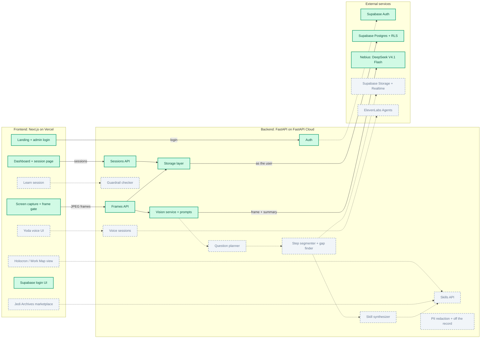

# Architecture

**Green = built and merged to `main`. Gray dashed = not built yet.** The picture is `docs/architecture.svg` (generated by `docs/make_architecture_svg.py`, opens anywhere). The Mermaid version below is the same map in text form, easy to diff and edit in a pull request; GitHub draws it, but its automatic layout is messier, so read the picture above.

Last checked against the code: 2026-10-04.

## Status by part

| Part | State | Notes |
|---|---|---|
| Landing page, admin login, dashboard, session page | Built | `frontend/app`; talks to the backend through `frontend/lib/api.ts` (token, mock mode) |
| Screen capture + frame gate | Built | Shibu's component, wired to the session page; sending frames from a real screen share has not been tested end to end |
| Auth (admin token, Supabase JWT check) | Built | `backend/app/auth.py`; default mode is `admin` |
| Sessions API, Frames API | Built | create, list, detail, frames; one call in flight, timeout, skip instead of failing |
| Vision service + prompts | Built | DeepSeek V4.1 Flash on Nebius, about 1 to 2 s per frame; 25 of 25 difference checks on our mock ERP frames (not yet tested on real screens) |
| Storage layer | Built | in memory (dev, admin), or Supabase called as the user (supabase mode); the deployed backend uses memory |
| Supabase database | Built | 8 tables with row-level security, sign-up profile trigger, owner write policies |
| Supabase Auth login | Built | email and password, tested live (`docs/supabase-login.md`); not switched on in the deployments yet, Google not set up (#40) |
| Supabase Storage + Realtime | Not built | bucket and publication exist but nothing uses them |
| Yoda voice (ElevenLabs agents, voice UI, pause controller, voice sessions) | Not built | tickets #25, #26, #28 |
| Question planner | Not built | prompt written (`backend/app/prompts/question_planner.system.md`), no code (#27) |
| Step segmenter, gap finder, skill synthesizer, skills API | Not built | needed for the debrief, the Holocron and the marketplace |
| Holocron view, Jedi Archives marketplace, learn session | Not built | tickets #33, #34, #37 |
| Guardrail checker | Not built | learn mode, stops the wrong move before Save |
| PII redaction, off the record | Not built | Presidio is not used anywhere yet |

## Deployments
- **Frontend (Vercel):** the build is blocked, so the old page is still live. See `docs/deployment.md`.
- **Backend (FastAPI Cloud):** live, but it runs open (`AUTH_MODE=dev`). Set `AUTH_MODE=admin` and your own `ADMIN_PASSWORD` (see `docs/deployment.md`).

## Mermaid source

## Keeping it honest
When you build or merge a part, turn it green: set `built=True` for its box in `docs/make_architecture_svg.py` and run `python3 docs/make_architecture_svg.py` (it rewrites `docs/architecture.svg`), change `todo` to `built` in the Mermaid block, and update the status table. Do not paint a part green until it is merged to `main` and has been run at least once.
